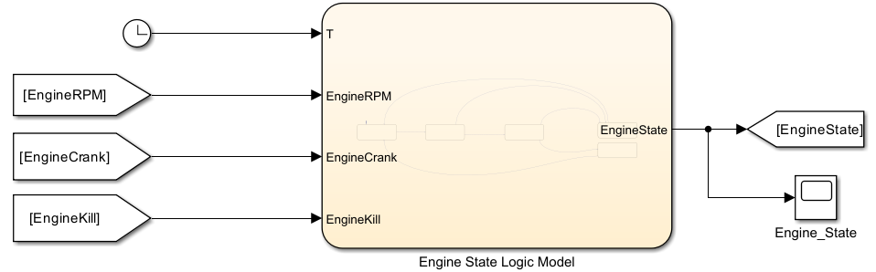

[← Back to Portfolio Home](index.html)

# Configurable Hybrid Electric Learning Module (CHELM) Control System

## 📌 Project Overview
This project details the end-to-end development, calibration, and **Hardware-in-the-Loop (HIL)** validation of a supervisory control system for a Configurable Hybrid Electric Learning Module (CHELM). 

Using a **Model-Based Embedded Control System Design** approach, I developed a High-Level Electronic Control Unit (ECU) in **MATLAB/Simulink** and **Stateflow** to manage complex hybrid powertrain operations, including multi-mode switching, engine state management, torque blending, and stepper motor throttle actuation. The logic was successfully deployed and tested in real-time using a **dSPACE MicroAutoBox III**.

---

## 🏗️ System Architecture & Control Logic

### 1. Hybrid Driving Mode Controller
Implemented a discrete-event state machine to govern the vehicle's operating mode. The transitions evaluate vehicle speed ($< 1 \text{ mph}$ threshold) and driver inputs to switch between EV Solo Mode, Engine Solo Mode, and Blending Mode.

### 2. Engine State Management (FSM)
Engineered a safety-critical Finite State Machine in Stateflow to manage the ICE states (`Off` $\rightarrow$ `Crank` $\rightarrow$ `Warm-up` $\rightarrow$ `On` $\rightarrow$ `Start Fail`). 

### 3. Distributed CAN Communication Network
Architected a multi-node network using **Vector CANdb++**. Used **ConfigurationDesk Bus Manager** to map Simulink model ports directly to physical CAN hardware channels, ensuring synchronized real-time frame transmission.

---

## 🧪 Hardware-in-the-Loop (HIL) Validation & Results

The system was deployed onto the **dSPACE MicroAutoBox III** for real-time validation. I engineered custom **ControlDesk** instrumentation panels to perform on-the-fly signal calibration and monitor system responses.

* **Mode Chattering Prevention:** Verified mode-switching requests above $1 \text{ mph}$ were safely ignored.
* **CAN Network Stability:** Monitored signal period and offset integrity between simulated ECUs.
* **Actuation Accuracy:** Validated stepper motor phase sequences aligning perfectly with dynamic Engine Torque Requests.

---
[← Back to Portfolio Home](index.html)
