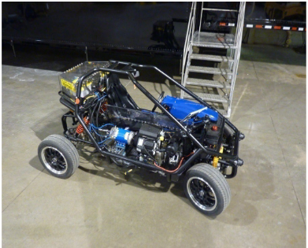
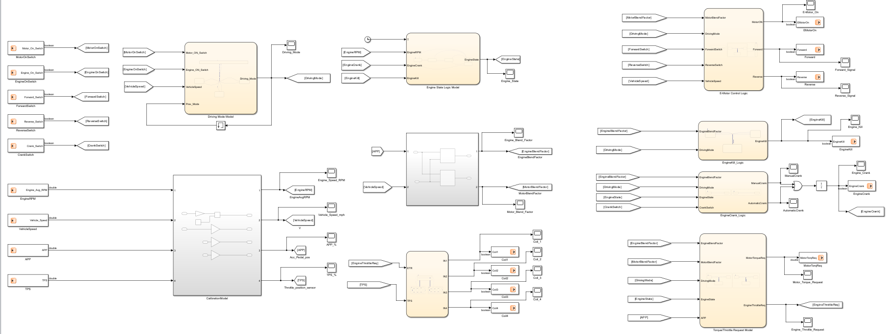
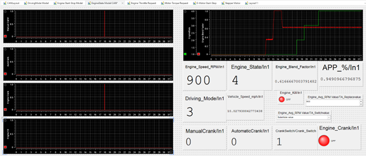

[← Back to Portfolio Home](index.html)

# Configurable Hybrid Electric Learning Module (CHELM) Control System

## 📌 Project Overview
This project details the end-to-end development, calibration, and **Hardware-in-the-Loop (HIL)** validation of a supervisory control system for a Configurable Hybrid Electric Learning Module (CHELM). 

Using a **Model-Based Embedded Control System Design** approach, I developed a High-Level Electronic Control Unit (ECU) in **MATLAB/Simulink** and **Stateflow** to manage complex hybrid powertrain operations. The control logic handles multi-mode switching, engine state management, torque blending, and stepper motor throttle actuation. The logic was successfully deployed and tested in real-time using a **dSPACE MicroAutoBox III**.

### 🛠️ Core Technologies & Toolchain
* **Software:** MATLAB, Simulink, Stateflow, dSPACE ConfigurationDesk, dSPACE ControlDesk, Vector CANdb++
* **Hardware:** dSPACE MicroAutoBox III (DS1511 Break-Out Box), 28BYJ-48 Stepper Motor, ULN2003 Driver
* **Protocols:** CAN Bus Communication (DBC architecture)

---

## 🏗️ System Architecture & Sub-Models

The high-level control system is designed to take raw analog/digital inputs (Accelerator Pedal Position, Throttle Position, Engine RPM, Vehicle Speed, and Driver Switches) and compute optimal power requests and actuation signals. 

### 1. Analog Input Calibration
Engineered a calibration layer to map raw 0-5V analog voltage signals from the hardware potentiometer interface into physical units for control logic processing. 
* Converted analog inputs into precise scales: Engine RPM (10–3000 rpm), Vehicle Speed (0–19 mph), and Pedal/Throttle positions (0–100%).

### 2. Hybrid Driving Mode Controller
Implemented a discrete-event state machine to govern the vehicle's operating mode, preventing mid-drive mode switching. When the vehicle speed is below 1 mph, the driver can switch between three modes:
* **Electric Solo Mode (EV):** E-motor is active; Engine is killed.
* **Engine Solo Mode:** Internal Combustion Engine (ICE) takes full load; E-motor is off.
* **Blending Mode:** Power is dynamically split between the ICE and E-motor based on vehicle speed and Accelerator Pedal Position (APP) via custom 2D lookup tables (Blend Factors).

### 3. Engine State Management (FSM)
Engineered a safety-critical Finite State Machine in Stateflow to manage the ICE states (Off → Crank → Warm-up → On → Start Fail). 
* Incorporated time-based delays and engine RPM feedback to govern transitions (e.g., transition to Warm-up requires >800 rpm and a crank time between 1.2s and 2s).
* Implemented automatic failure recovery: If the engine drops below 50 rpm or the kill signal is activated, it safely resets to the Off state.

### 4. Engine Start/Stop & Torque Distribution Logic
* **Automatic vs. Manual Cranking:** Designed logic to allow manual ignition (via key switch) during Engine Solo mode, and automatic cranking during Blending mode whenever the engine blend factor exceeds 0.01.
* **Torque Request Models:** Engine Throttle Request (ETR) and E-Motor Torque Request are dynamically calculated. In Blending mode, requests are the product of the pedal position (APP) and their respective blend factors.

### 5. Distributed CAN Communication Network
Architected a multi-node network to facilitate data exchange between the High-Level ECU and Powertrain ECU. 
* Defined the CAN matrix using **Vector CANdb++** (storing as a .dbc file).
* Used **ConfigurationDesk Bus Manager** to map Simulink model ports directly to physical CAN hardware channels.

### 6. Electromechanical Throttle Actuation
Designed a discrete control loop to actuate the engine throttle using a 28BYJ-48 Stepper Motor. The controller calculates the error between the Engine Torque Request (ETR) and the current Throttle Position Sensor (TPS) feedback, driving the motor clockwise or anti-clockwise by generating precise phase logic sequences via a ULN2003 driver.

---

## 🧪 Hardware-in-the-Loop (HIL) Validation & Results

The system was deployed onto the **dSPACE MicroAutoBox III** for real-time validation. I engineered custom **ControlDesk** instrumentation panels to perform on-the-fly signal calibration and monitor system responses.

### Key Validation Outcomes:
* **Mode Chattering Prevention:** Verified that mode-switching requests while traveling above 1 mph were safely ignored by the supervisory controller.
* **Fail-Safe Testing:** Real-time testing successfully demonstrated the engine state FSM smoothly handling "Start Fail" scenarios when simulated RPM unexpectedly dropped during warm-up.
* **CAN Network Stability:** Displayed I/O signals across both ECUs to verify CAN message periods and ensure offset integrity, maintaining stable communication over 10-second test windows.
* **Actuation Accuracy:** Real-time visual validation confirmed the stepper motor coil excitation signals aligned perfectly, generating the necessary torque request responses without system delay.

---
[← Back to Portfolio Home](index.html)
